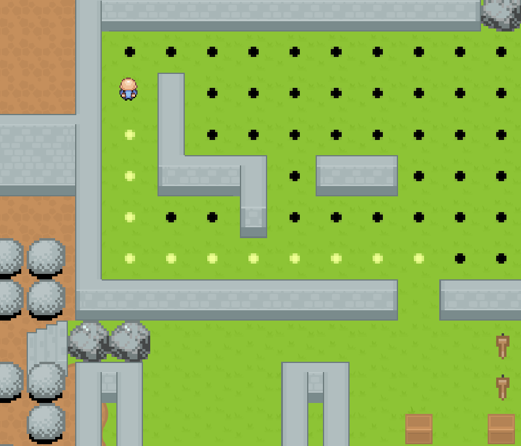

# GridGame
A grid game where you incarnate an old sensei trying to solve enigmas to escape a castle.
Press **L** to interact with object, press **Space** to pause and unnpause the game.

To play this game, launch the GridGame.jar file.  
To regenerate the JAR executable, run ```mvn clean compile assembly:single```

## Teaser

<p float="left">
  
   
  
</p>
